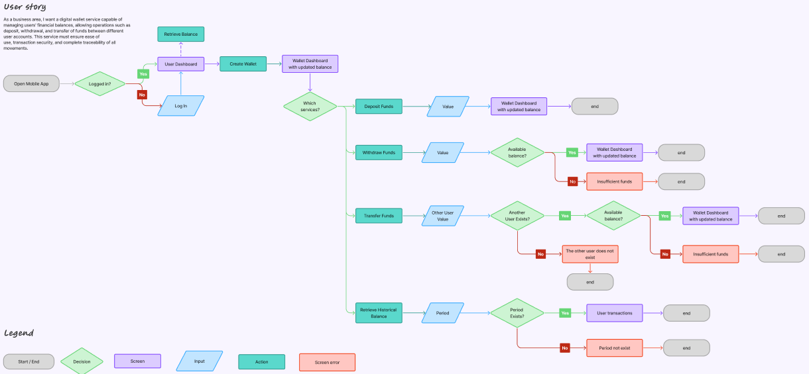
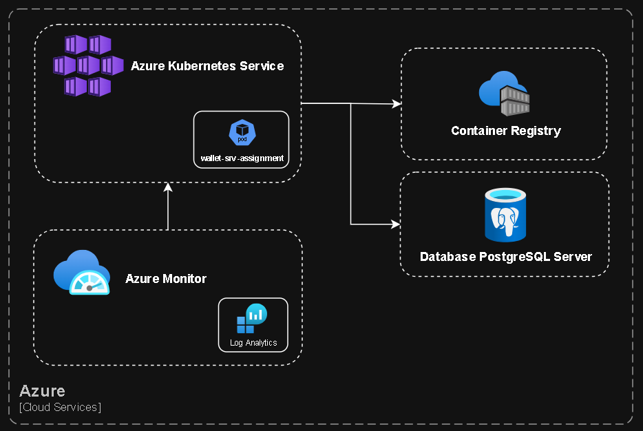

## 💼 Case - Wallet Service Assignment

### 📌 Objective
This project aims to implement a digital wallet microservice. It supports wallet creation and key financial operations 
such as deposits, withdrawals, transfers, and balance inquiries — including the ability to retrieve historical balances.

Detailed information regarding the business context, system architecture, and chosen technologies can be found 
throughout this README.

---

### 📑 Index

- [🧠 Pre-Development](#-pre-development)
- [📊 Business Requirement](#-business-requirement)
- [🧭 Business Journey](#-business-journey)

---
    
### 🧠 Pre-Development

Given that this project simulates a real-world production scenario, it is essential to execute certain steps prior to the development phase. These preliminary stages allow the architecture and engineering teams to analyze the business requirements, design the most suitable technical solution, and provide a clear and structured direction to the development team.

Below is a concise overview of the initial phases of this process:

Business Requirement ➡️ Business Journey ➡️ Architecture Design ➡️ Technical Refinement ➡️ Development

---

### 📊 Business Requirement

As a business area, I want a digital wallet service capable of managing users' financial balances, allowing operations 
such as deposit, withdrawal, and transfer of funds between different user accounts. This service must ensure ease of use, transaction security, and complete traceability of all movements.

#### Functional Requirements 

- Create Wallet: Allow the creation of wallets for users.
- Retrieve Balance: Retrieve the current balance of a user's wallet.
- Retrieve Historical Balance: Retrieve the balance of a user's wallet at a specific
  point in the past.
- Deposit Funds: Enable users to deposit money into their wallets.
- Withdraw Funds: Enable users to withdraw money from their wallets.
- Transfer Funds: Facilitate the transfer of money between user wallets.

#### Non-functional requirements

This service is mission-critical. Any downtime would significantly impair the platform's ability to
perform most operations.

Given that the service handles monetary transactions, it is imperative to ensure full traceability of
all operations to facilitate auditing of wallet balances.

---

### 🧭 Business Journey

As this is a secondary aspect of the case, presented below is a flowchart illustrating the customer journey in 
accordance with the business requirements.

[Flow Journey]

---

### 🧱 Architecture Design

[Architecture Design]

#### Parecer da Arquitetura

Adopt a cloud infrastructure in order to ensure speed and efficiency in the provisioning of the resources required 
by the project.

##### Technologies

✅ Kubernetes (AKS): Ensure high availability and scalability of the application, aligned with the specific demands 
of the project.

✅ Container Registry (ACR): Intended for the secure and centralized storage of the Docker images used by the 
application.

...